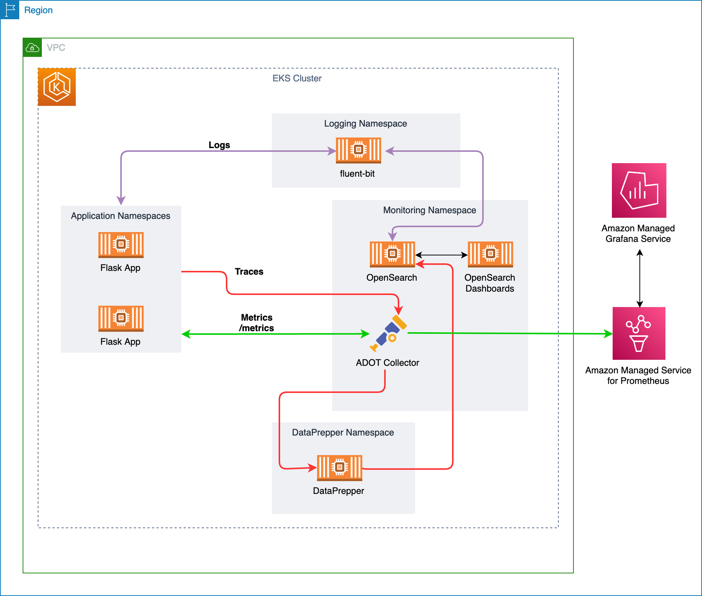

# EKS Observability with OpenSearch

This demonstration has the focus of provision Amazon EKS, Amazon Managed Prometheus, Amazon Managed Grafana and OpenSearch with Open Telemetry Collector in order to achive the complete observability stack. Logs, tracing and metrics.

# Steps

- Provision EKS Cluster with Managed NodeGroups X
- Setup ADOT Operator as Managed add-on in the cluster X
- Install metric-server, node-exporter and kube-state-metrics X
- Install OpenSearch using Helm X
- Provision Amazon Managed Prometheus X
- Provision Amazon Managed Grafana X
- Setup Data Prepper in order to integrate with OpenSearch X
- Create Open Telemetry Pipeline X
- Deploy the sample applications inside the cluster X
- Deploy fluentbit and send it to OpenSearch X
- Check OpenSearch Dashboard X

# Architetcure

<p align="center"> 

</p>

# Export Useful Variables

```bash
export AWS_DEFAULT_REGION="YOUR AWS REGION"
export ACCOUNT_ID=$(aws sts get-caller-identity --output text --query Account)
```

# Provision EKS Cluster

```bash
sed -i -e "s/__AWS_REGION__/${AWS_DEFAULT_REGION}/g" ./observabilitydemo.yaml

eksctl create cluster -f observabilitydemo.yaml
```

Now wait about 15 minutes in order to have your cluster up and running.

Update your `kubeconfig`

```bash
aws eks update-kubeconfig --name eks-observablity-cluster --region ${AWS_DEFAULT_REGION}
```

# Setup ADOT Collector as Managed Add-On

> **Warning:** Your Amazon EKS cluster must be using Kubernetes version 1.19 or higher

Before installing the AWS Distro for OpenTelemetry (ADOT) add-on, you must meet the following prerequisites.

```bash
kubectl apply -f https://amazon-eks.s3.amazonaws.com/docs/addons-otel-permissions.yaml
```

## Installing cert-manager

The ADOT Operator uses admission webhooks to mutate and validate the Collector Custom Resource (CR) requests. In Kubernetes, the webhook requires a TLS certificate that the API server is configured to trust.

TBD: Change the cert-managed manifests to deploy it on infra nodes.

```bash
kubectl apply -f https://github.com/cert-manager/cert-manager/releases/download/v1.8.2/cert-manager.yaml
```

## Create ADOT IAM role

```bash
kubectl create ns monitoring

eksctl create iamserviceaccount \
    --name aws-otel-collector \
    --namespace monitoring \
    --cluster eks-observablity-cluster \
    --attach-policy-arn arn:aws:iam::aws:policy/AmazonPrometheusRemoteWriteAccess \
    --attach-policy-arn arn:aws:iam::aws:policy/AWSXrayWriteOnlyAccess \
    --attach-policy-arn arn:aws:iam::aws:policy/CloudWatchAgentServerPolicy \
    --approve \
    --override-existing-serviceaccounts
```

## Install ADOT Operator Amazon EKS add-on

```bash
aws eks create-addon --addon-name adot --cluster-name eks-observablity-cluster
```

# Installing needed add-ons

## metric-server

Metrics Server collects resource metrics from Kubelets and exposes them in Kubernetes apiserver through Metrics API for use by Horizontal Pod Autoscaler and Vertical Pod Autoscaler. Metrics API can also be accessed by kubectl top, making it easier to debug autoscaling pipelines.

```bash
kubectl apply -f https://github.com/kubernetes-sigs/metrics-server/releases/latest/download/components.yaml
```

## kube-state-metrics

kube-state-metrics (KSM) is a simple service that listens to the Kubernetes API server and generates metrics about the state of the objects. (See examples in the Metrics section below.) It is not focused on the health of the individual Kubernetes components, but rather on the health of the various objects inside, such as deployments, nodes and pods.

```bash
kubectl apply -f ./add-ons/kube-state-metrics
```

## node-exporter

To get all the kubernetes node-level system metrics, you need to have a node-exporter running in all the kubernetes nodes. It collects all the Linux system metrics and exposes them via /metrics endpoint on port 9100

```bash
kubectl apply -f add-ons/kubernetes-node-exporter
```

# Install Opensearch Operator and Setup Cluster

**OpenSearch** is a community-driven, Apache 2.0-licensed open source search and analytics suite that makes it easy to ingest, search, visualize, and analyze data. Developers build with OpenSearch for use cases such as application search, log analytics, data observability, data ingestion, and more.

**The Kubernetes OpenSearch Operator** is used for automating the deployment, provisioning, management, and orchestration of OpenSearch clusters and OpenSearch dashboards.

Installing the operator.

```bash
cd ./add-ons/opensearch-operator/ && ./install.sh
```

Now that we have installed the operator, let's setup our OpenSearch Cluster.

```bash
kubectl apply -f opensearch-cluster.yaml
```

Now wait for the OpenSearch cluster to be up and running, if you want to follow the setup just execute the command below.

```bash
kubectl get pods -nmonitoring -w
```

# Provision AWS Managed Prometheus

Create AMP workspace

```bash
aws amp create-workspace --alias eks-observability-demo --region us-east-2
```

# Provision Managed Grafana

To learn how to provision Amazon Managed Grafana Service follow this [link](https://www.eksworkshop.com/intermediate/246_monitoring_amp_amg/create_amg_workspace/)

# Deploy Data-Prepper

Data Prepper is a component of the OpenSearch project that accepts, filters, transforms, enriches, and routes data at scale.

```bash
cd ../ && kubectl apply -f ./data-prepper
```

# Creating ADOT Pipeline

Now that we have all the components up and running its time to create the OpenTelemetry Pipeline.

Getting Amazon Managed Prometheus `remote write` URL.

```bash
export WORKSPACE_ID=$(aws amp list-workspaces | jq '.workspaces' | jq '.[].workspaceId' | tr -d '"')
```

Change the URL inside the pipeline manifest.

```bash
sed -i -e "s/__WORKSPACE_ID__/${WORKSPACE_ID}/g" adot-collector/04-open-telemetry-pipeline.yaml

sed -i -e "s/__AWS_REGION__/${AWS_DEFAULT_REGION}/g" adot-collector/04-open-telemetry-pipeline.yaml
```

Apply the pipeline manifest:

```bash
kubectl apply -f adot-collector/
```

# Deploying Sample Applications

In this demonstration we already have developed two samples applications and we have already intrumented it with Open Telemetry.

## Creating application ECR repositories

Let's create the ECR repositories to host the container images of the applications that we are going to deploy in the cluster.

> **Go back to the root of the demonstration folder**

```bash
aws ecr create-repository --repository-name flask-app-1

aws ecr create-repository --repository-name flask-app-2
```

## Building Application Container Images and Deploying it into EKS

First we are going to build the first flask application image, replace the image URI into the Kubernetes manifest and deploy the application in the cluster.

```bash
cd applications/flask-app && docker build -t flask-app:latest .

aws ecr get-login-password --region ${AWS_DEFAULT_REGION} | docker login --username AWS --password-stdin ${ACCOUNT_ID}.dkr.ecr.${AWS_DEFAULT_REGION}.amazonaws.com

docker tag flask-app:latest ${ACCOUNT_ID}.dkr.ecr.${AWS_DEFAULT_REGION}.amazonaws.com/flask-app-1:latest

docker push ${ACCOUNT_ID}.dkr.ecr.${AWS_DEFAULT_REGION}.amazonaws.com/flask-app-1:latest

export FLASK_APP_1_URI="${ACCOUNT_ID}.dkr.ecr.${AWS_DEFAULT_REGION}.amazonaws.com/flask-app-1:latest"

sed -i -e "s@__FLASK_APP_1_URI__@${FLASK_APP_1_URI}@g" kubernetes/00-deployment.yaml

kubectl apply -f kubernetes/
```

Then, let's do the same thing for the second flask application.

```bash
cd ../flask-app-2 && docker build -t flask-app-2:latest .

docker tag flask-app-2:latest ${ACCOUNT_ID}.dkr.ecr.${AWS_DEFAULT_REGION}.amazonaws.com/flask-app-2:latest

docker push ${ACCOUNT_ID}.dkr.ecr.${AWS_DEFAULT_REGION}.amazonaws.com/flask-app-2:latest

export FLASK_APP_2_URI="${ACCOUNT_ID}.dkr.ecr.${AWS_DEFAULT_REGION}.amazonaws.com/flask-app-2:latest"

sed -i -e "s@__FLASK_APP_2_URI__@${FLASK_APP_2_URI}@g" kubernetes/00-deployment.yaml

kubectl apply -f kubernetes/
```

# Deploying Fluent-bit for logging

Fluent Bit is an open source and multi-platform Log Processor and Forwarder which allows you to collect data/logs from different sources, unify and send them to multiple destinations. It’s fully compatible with Docker and Kubernetes environments.

Let's deploy fluentbit

> **Go back to the root of the demonstration folder**

```bash
kubectl apply -f add-ons/fluent-bit
```